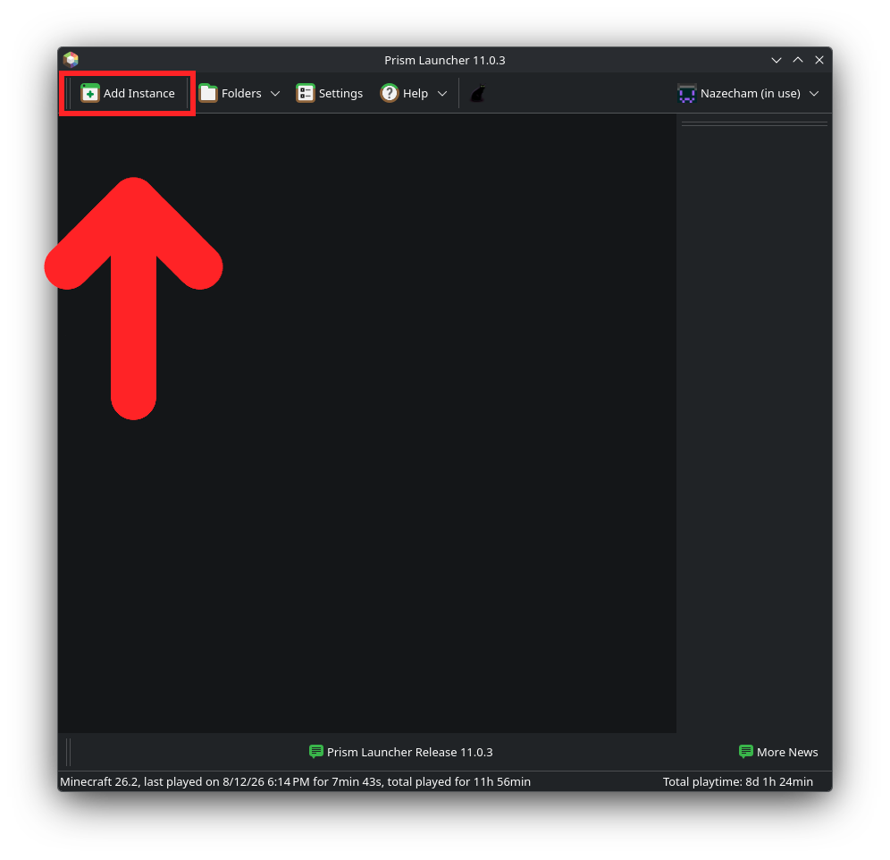
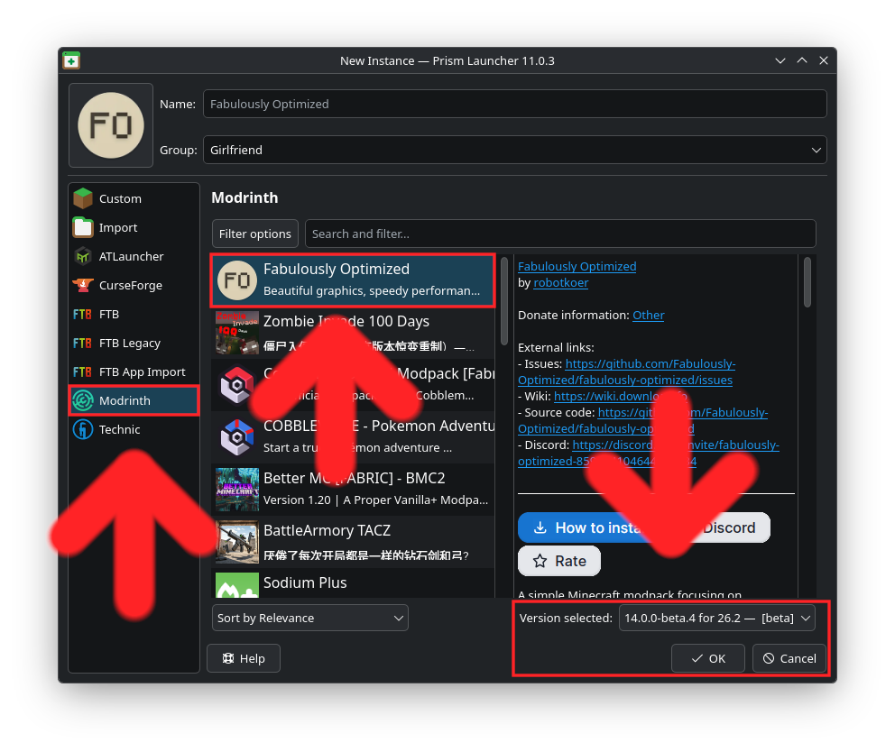

# Simple Voice Chat Installation

If you're on Bedrock, this does not apply to you. Voice Chat is only compatible with Java.

Go to [https://prismlauncher.org/download](prismlauncher.org) and download the correct version for your platform. For Windows, I recommend using the installer as opposed to the portable version.

Make sure you follow the directions properly and ensure you have signed in with your Microsoft Account.

Once installed, open Prism Launcher and click "Add Instance" at the top right. 

A new window should open up, at the left, press "Modrinth", then "Fabulously Optimized" (it should be at the top, if not, search it), then make sure that it is on the correct version, which should say `* for 26.2` and press Ok to install it. 